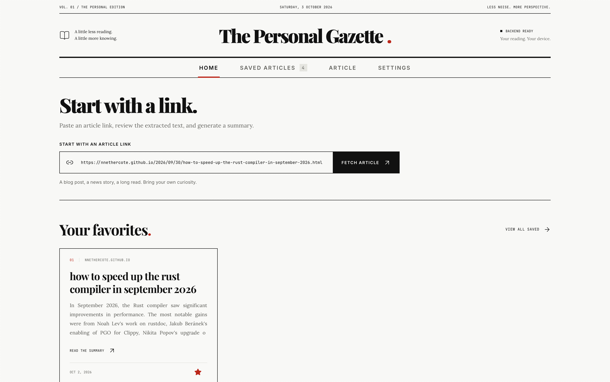
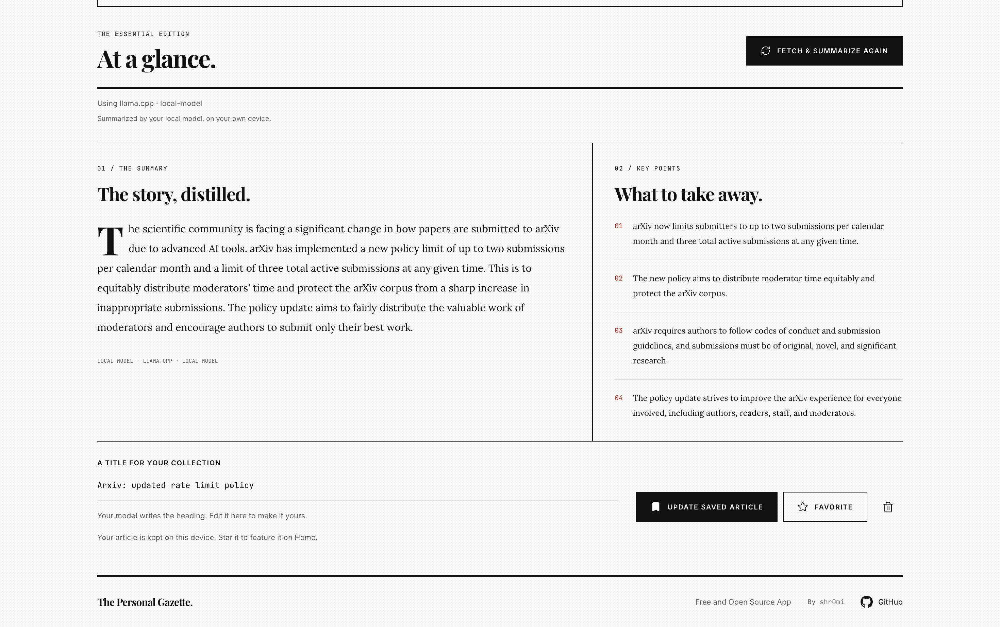
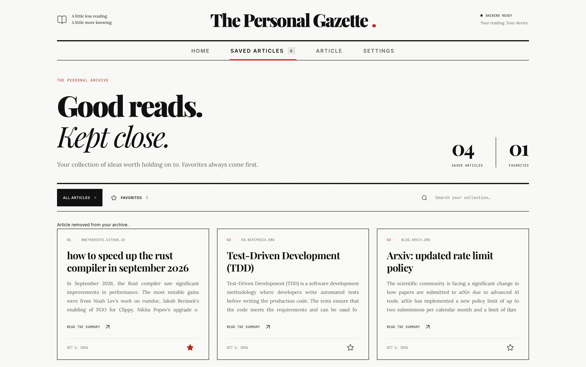
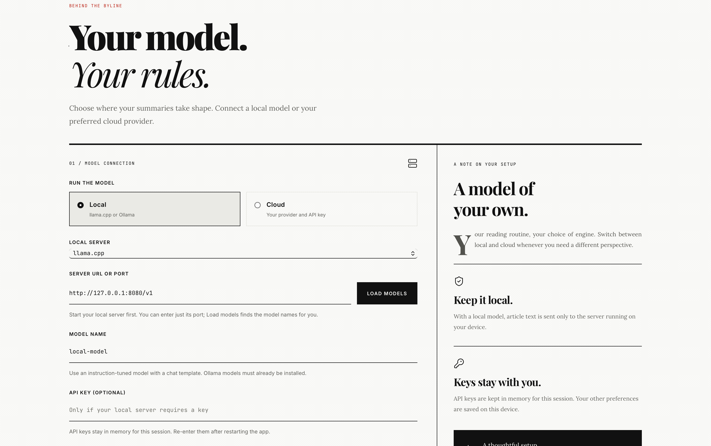

<div align="center">
  
  <h1>Personal Gazette</h1>
  <p>A personal newspaper for saving articles, summarizing them with AI, and remembering what matters.</p>
</div>

## Screenshots

<table>
  <tr>
    <td width="50%" align="center">
      <strong>Home</strong><br />
      <a href="./screenshots/HomePage.png"></a>
    </td>
    <td width="50%" align="center">
      <strong>Article summary</strong><br />
      <a href="./screenshots/ArticlesPage.png"></a>
    </td>
  </tr>
  <tr>
    <td width="50%" align="center">
      <strong>Saved articles</strong><br />
      <a href="./screenshots/SavedArticlesPage.png"></a>
    </td>
    <td width="50%" align="center">
      <strong>Settings</strong><br />
      <a href="./screenshots/SettingsPage.png"></a>
    </td>
  </tr>
</table>

## What it does

Personal Gazette is a local-first desktop app for knowledge workers who want to keep the ideas they find online. Its newspaper-inspired interface turns your reading into a searchable personal archive.

- **Extract articles:** paste a URL to fetch the main article text, then review or edit it before summarizing.
- **Distill the key ideas:** generate a concise summary, key points, and an editable heading in the article's language.
- **Build your archive:** save the source link, title, summary, key points, and model details on your device. Saving the same link updates its existing entry.
- **Find what matters:** search saved articles by title, source, or summary. Favorite articles to bring them to the top of your library and onto Home.
- **Revisit and refresh:** reopen saved summaries after restarting the app, or fetch and summarize an article again with your current model settings.
- **Choose your model:** use a model running on your computer or connect your preferred cloud provider.

To get started, configure a model in **Settings**, paste a link on **Home**, and click **Fetch article**. Review **Extracted text**, click **Summarize article**, adjust the title if needed, and click **Save article**.

### Your data

Saved articles and non-secret model preferences use local device storage. API keys stay in memory for the current session and must be entered again after restarting. Original extracted text is kept only for the current session; reopen the source with **Fetch article** when you need it again. Clearing the app's storage removes your archive.

Fetching an article requires an internet connection. Local summarization sends text only to your configured local server; cloud summarization sends it to the selected provider when you request a summary. Pages that require a login or JavaScript, or that block automated downloads, may not be extractable.

## Supported LLM providers

Model requests run through **LiteLLM**, with the following providers available in the app:

| Mode | Provider | Connection details |
| --- | --- | --- |
| Local | **llama.cpp** | A running `llama-server`, a model ID, and its local URL or port. Default: `http://127.0.0.1:8080/v1`. |
| Local | **Ollama** | A running Ollama server, an installed model, and its local URL or port. Default: `http://127.0.0.1:11434`. |
| Cloud | **OpenAI** | Model ID and API key. |
| Cloud | **Anthropic** | Model ID and API key. |
| Cloud | **Google Gemini** | Model ID and API key. |
| Cloud | **OpenRouter** | Model ID in `provider/model-name` format and API key. |
| Cloud | **Azure OpenAI** | Deployment name in the model field, API key, resource endpoint, and API version. |
| Cloud | **Other OpenAI-compatible provider** | Model ID, API key, and an HTTPS API base URL, usually ending in `/v1`. |

Open **Settings**, choose **Local** or **Cloud**, enter the connection details, and click **Save settings**. For local servers, **Load models** discovers the available model IDs. An API key is optional for local servers unless the server requires one. Standard cloud providers use their default endpoints unless you supply an override; all cloud endpoints must use HTTPS.

Local mode accepts loopback addresses only (`localhost`, `127.0.0.1`, or `::1`) and never falls back to a cloud model. Cloud calls use your provider account and may incur charges. Choose an instruction-tuned model with enough context for your article; text is sent without silent truncation.

<details>
<summary><strong>Set up a local model</strong></summary>

**llama.cpp** — start a server with your instruction-tuned GGUF model:

```sh
llama-server -m /path/to/model.gguf --host 127.0.0.1 --port 8080 --alias local-model -c 8192
```

In Settings, choose **llama.cpp**, enter `http://127.0.0.1:8080/v1` or just `8080`, and click **Load models**. Adjust the context size to suit your model and article length.

**Ollama** — start the server if it is not already running:

```sh
ollama serve
```

In another terminal, install your chosen model:

```sh
ollama pull <model-name>
```

In Settings, choose **Ollama**, enter `http://127.0.0.1:11434` or just `11434`, and click **Load models**.

</details>

## Development

### Tech stack

| Layer | Technologies |
| --- | --- |
| Interface | React 19, TypeScript, Vite 8, CSS, Lucide icons |
| Desktop host | Tauri 2 and Rust |
| Local API | Python, FastAPI, Uvicorn, Pydantic |
| Article extraction | Trafilatura |
| Model integration | LiteLLM and HTTPX |
| Storage | WebView `localStorage` for saved articles and non-secret preferences |
| Packaging | PyInstaller bundles the Python API as a Tauri sidecar |
| Tests | Node's built-in test runner and Python `unittest` |

The React interface calls Tauri commands, which forward requests to a local FastAPI sidecar. The Rust host starts and stops that process, chooses a free loopback port, and authenticates API requests with a per-launch token.

### Prerequisites

- **Node.js 22.12 or newer** and npm. Vite also supports Node.js 20.19+ within the Node 20 release line.
- **Rust** with a desktop host target available through `rustc --print host-tuple`.
- **Python 3.11 or newer**, with `venv` and `pip`.
- The [Tauri desktop prerequisites](https://v2.tauri.app/start/prerequisites/) for your operating system.
- A running local model server or cloud provider credentials to generate summaries.

### Run the app

From the repository root:

```sh
npm ci
npm run setup:python
npm run dev:desktop
```

`setup:python` creates `.venv` and installs the backend and packaging dependencies. `dev:desktop` builds the Python sidecar, starts the Vite development server, and opens the Tauri desktop app. Dependencies stay in the repository's `node_modules` and `.venv` directories.

For interface-only work:

```sh
npm run dev
```

This starts Vite at `http://localhost:1420`. Article fetching and summarization require the desktop app and its sidecar, so use `dev:desktop` to exercise the full workflow.

### Run tests

Run these commands from the repository root after installing dependencies:

```sh
# Frontend: model settings, saved articles, favorites, refresh, and external links
npm test

# Backend: install test dependencies, then run extraction and model-routing tests
.venv/bin/python -m pip install -r backend/requirements-dev.txt
.venv/bin/python -m unittest discover -s backend/tests -v
```

On Windows, replace `.venv/bin/python` with `.venv/Scripts/python.exe`.

Backend tests mock downloads and model calls, while using a real HTML fixture with Trafilatura for extraction. The tests do not require a running model server or cloud API key and can run offline once dependencies are installed.

Run the compilation checks as well when changing application code:

```sh
npm run build
cargo check --manifest-path src-tauri/Cargo.toml --locked
```

If the Python sidecar has not been built yet, run `npm run build:sidecar` before `cargo check`; Tauri expects the configured sidecar binary to exist.

### Build a desktop bundle

```sh
npm run build:desktop
```

This builds the frontend, packages the Python sidecar, and produces desktop bundles under `src-tauri/target/release/bundle/`. Build on each target operating system and architecture; the sidecar packaging step does not cross-compile.

### Repository layout

```text
src/          React pages, article state, model settings, and frontend tests
src-tauri/    Rust desktop host, Tauri configuration, and app icons
backend/      FastAPI endpoints, extraction, model integration, and backend tests
scripts/      Python environment setup and sidecar packaging
logo.png      Personal Gazette logo
```
